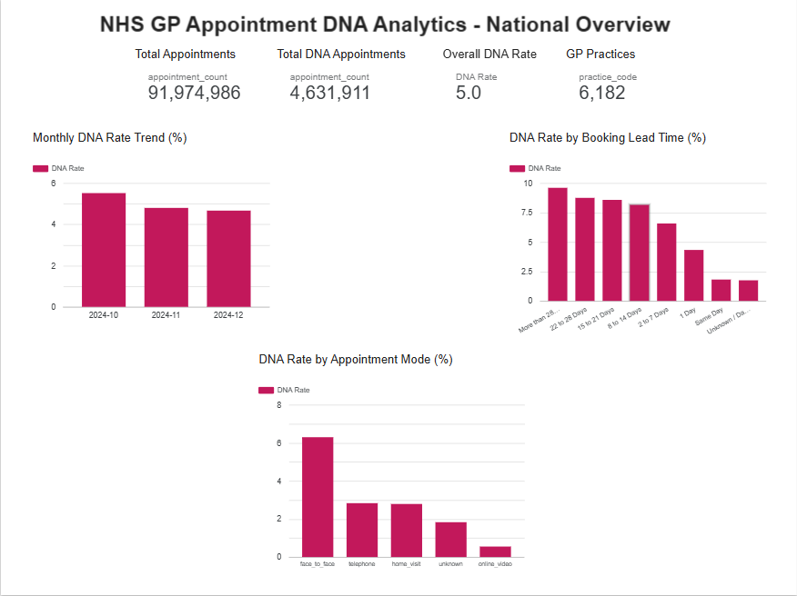
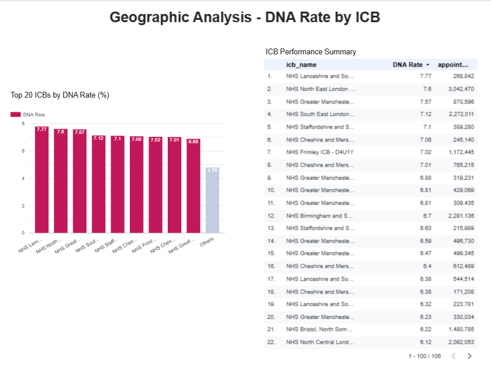
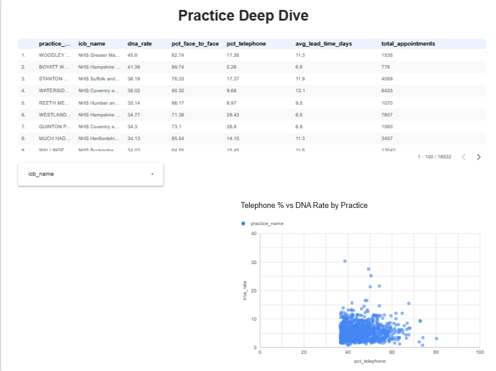
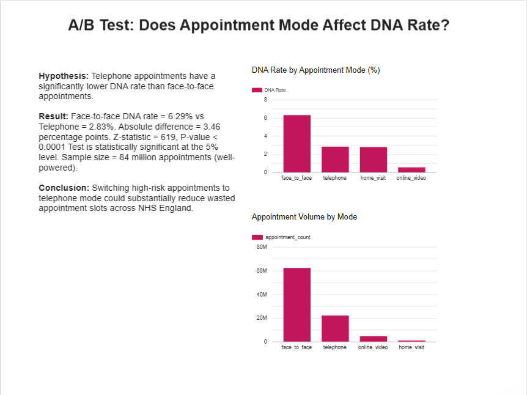

# NHS GP Appointment DNA Analytics Platform


## Project Overview

End-to-end analytics platform analysing Did Not Attend (DNA) rates 
across NHS GP practices in England. Built for a hypothetical NHS 
Integrated Care Board to identify high-risk practices, understand 
what drives non-attendance, and test whether appointment mode 
significantly affects DNA rates.

Uses three months of real NHS England open data (Oct–Dec 2024) 
covering 92 million appointments across 6,182 GP practices and 
106 Integrated Care Boards.

---

## Business Questions Answered

- Which GP practices and ICBs have the highest DNA rates?
- Does appointment mode (telephone vs face-to-face) significantly 
  affect DNA rates?
- Does booking lead time predict non-attendance?
- Can we predict which practices are at risk of high DNA rates?
- What operational changes would most reduce wasted appointment slots?

---

## Key Findings

- **Overall DNA rate: 5.0%** — 4.6 million wasted appointments 
  across Oct–Dec 2024
- **Face-to-face DNA rate (6.29%) is more than double telephone 
  (2.83%)** — a 3.46 percentage point difference, statistically 
  significant at p < 0.0001 across 84 million appointments
- **DNA rate rises consistently with booking lead time** — same day 
  appointments have 1.8% DNA rate vs 9.6% for appointments booked 
  more than 28 days in advance
- **Lancashire and South Cumbria ICB has the highest DNA rate (7.77%)** 
  followed by North East London (7.6%) and Greater Manchester (7.57%)
- **XGBoost model predicts high-DNA practices with 0.80 ROC-AUC** — 
  ICB-level average DNA rate is the strongest predictor, confirming 
  that geography and regional factors drive non-attendance more than 
  individual practice operations
- **DNA rate improved over the period** — from 5.5% in October to 
  4.7% in December 2024

---

## Technical Stack

| Tool | Purpose |
|---|---|
| Python + Pandas | Data loading, cleaning, and EDA |
| Google BigQuery | Cloud data warehouse |
| SQL | Analytical queries with window functions |
| XGBoost | High-DNA practice prediction model |
| scikit-learn | Model evaluation and train/test split |
| FastAPI | REST API serving live predictions |
| scipy + statsmodels | A/B test statistical analysis |
| Looker Studio | Interactive dashboard connected to BigQuery |
| Git + GitHub | Version control |

---

## Architecture

NHS England Open Data (CSV)
↓
Python (Pandas) — loading and EDA
↓
Google BigQuery (raw dataset — 92M appointments)
↓
SQL transformations — cleaning, feature engineering
↓
BigQuery (analytics dataset — appointments_clean, practice_summary)
↓ ↓ ↓
Looker Studio FastAPI REST API Python Notebooks
(4-page dashboard) (ML predictions) (A/B test, EDA, model)


---

## A/B Test: Telephone vs Face-to-Face

**Hypothesis:** Telephone appointments have a significantly lower 
DNA rate than face-to-face appointments.

**Method:** Two-proportion z-test on 84 million appointments.

**Result:**
- Face-to-face DNA rate: 6.29% (62.2M appointments)
- Telephone DNA rate: 2.83% (22.0M appointments)  
- Absolute difference: 3.46 percentage points
- Z-statistic: 619, P-value < 0.0001
- Test is statistically significant and well-powered

**Conclusion:** Switching high-risk appointments to telephone mode 
could substantially reduce wasted appointment slots across NHS England.

---

## ML Model: High-DNA Practice Prediction

**Model:** XGBoost classifier  
**Target:** Whether a GP practice has a DNA rate above 8%  
**Features:** Appointment mode mix, average lead time, practice size, 
ICB-level average DNA rate  
**Result:** 0.80 ROC-AUC on held-out test data (13.8% positive class)  
**Key insight:** ICB average DNA rate is the most important feature, 
showing geography drives DNA rates more than operational choices alone.

**API:** Deployed as a REST endpoint using FastAPI — accepts practice 
operational features and returns risk probability and recommendation.

Example prediction for a high face-to-face, long lead time practice 
in a high-DNA ICB:
```json
{
  "high_dna_probability": 0.858,
  "risk_level": "High Risk",
  "recommendation": "Consider shifting more appointments to telephone 
  or online mode. Review booking lead times."
}
```

---

## SQL Techniques Used

- Multi-table aggregations across 92 million records
- CASE statements for data standardisation and feature engineering
- Window functions — RANK for ICB performance benchmarking
- STDDEV and Z-score calculation for outlier detection
- PARSE_DATE for non-standard NHS date format handling
- Calculated fields and filtered aggregations for DNA rate metrics

---

## Dashboard

[View live dashboard](https://datastudio.google.com/reporting/ba71bec9-be52-4ec9-8a7e-805e76dbd31b)

### Dashboard Preview

**National Overview**


**Geographic Analysis**


**Practice Deep Dive**


**A/B Test Results**


---

## Repository Structure

nhs-dna-analytics/
├── notebooks/
│ ├── 1_eda.ipynb ← Exploratory data analysis
│ ├── 2_bigquery.ipynb ← BigQuery data loading
│ ├── 3_ab_test.ipynb ← A/B test analysis
│ └── 4_xgboost.ipynb ← ML model training
├── sql/
│ ├── 1_appointments.sql ← Data cleaning query
│ ├── 2_practice_summary.sql ← Practice-level aggregation
│ ├── 3_dna_overview.sql ← National DNA overview
│ ├── 4_dna_by_mode.sql ← DNA rate by appointment mode
│ ├── 5_dna_by_lead_time.sql ← DNA rate by booking lead time
│ ├── 6_icb_comparison.sql ← ICB benchmarking with RANK
│ └── 7_practice_outliers.sql ← Z-score outlier detection
├── api/
│ ├── main.py ← FastAPI application
│ └── model/
│ └── xgboost_dna.pkl ← Trained XGBoost model
├── screenshots/ ← Dashboard and chart exports
├── data
└── README.md


---

## Data Source

NHS England — Appointments in General Practice (Open Data)  
https://digital.nhs.uk/data-and-information/publications/statistical/appointments-in-general-practice

Published monthly. No registration required. Open Government Licence.

**Note on European data availability:** Patient-level appointment data 
equivalent to this dataset is not publicly available in Germany or most 
EU countries due to GDPR and national data protection laws 
(Bundesdatenschutzgesetz). NHS England's open data publication is among 
the most granular primary care datasets publicly available in Europe, 
making it an ideal proxy for European healthcare analytics work.

---

## How to Run

**1. Clone the repository**
```bash
git clone https://github.com/geethikakonduru/nhs-dna-analytics.git
cd nhs-dna-analytics
```

**2. Create virtual environment**
```bash
python -m venv venv
venv\Scripts\activate
pip install pandas numpy matplotlib seaborn jupyter scikit-learn xgboost scipy statsmodels google-cloud-bigquery google-auth pandas-gbq fastapi uvicorn joblib
```

**3. Download data**

**4. Set up BigQuery credentials**
Add your GCP service account JSON to `credentials/gcp_credentials.json`.

**5. Run notebooks in order**
```bash
jupyter notebook
```

**6. Run the API**
```bash
cd api
uvicorn main:app --reload
```
API docs available at `http://127.0.0.1:8000/docs`
